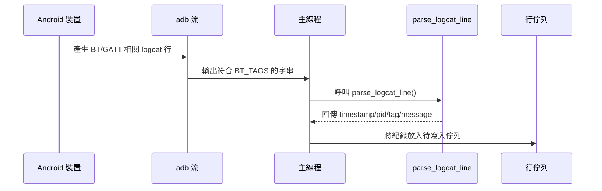
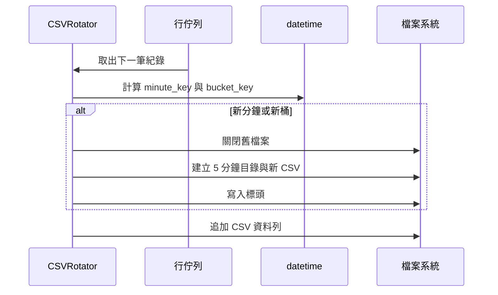
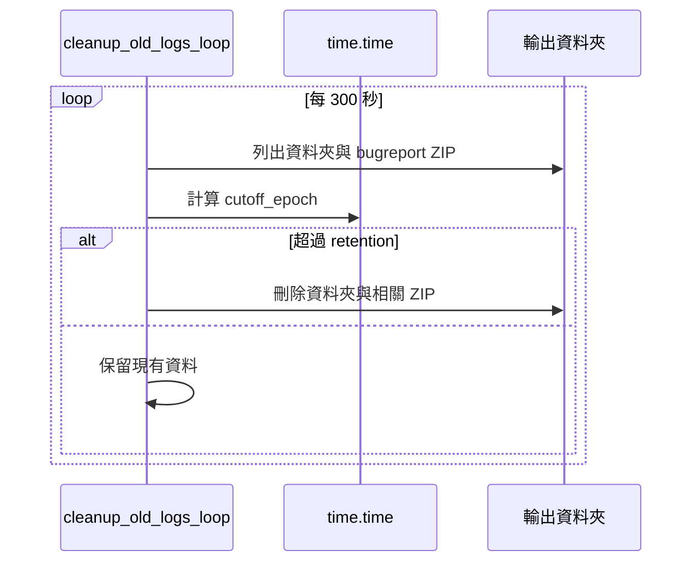
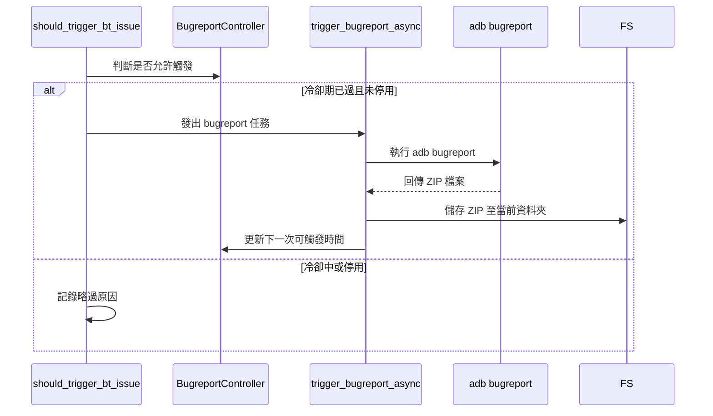
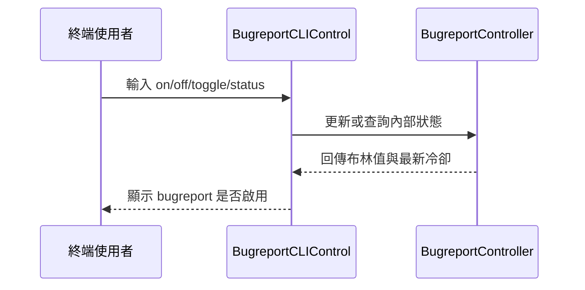

# logcat_rotate

`logcat_rotate` 專注於 Android 藍牙堆疊診斷，透過 `adb logcat -v threadtime` 持續擷取藍牙相關訊息、以分鐘為單位寫入 CSV，並依保留期自動輪轉與刪除舊資料。本文彙整版本沿革、檔案結構、功能時序圖與多平台安裝流程，協助你快速啟用並安全維運。

## 版本資訊
| 版本 | 日期 | 核心更新 | 影響 | 備註 |
| --- | --- | --- | --- | --- |
| v1.3.0 | 2024-06-12 | 加入 Bugreport CLI 控制、支援自訂冷卻間隔 | 需互動式終端 | 建議 Python ≥ 3.9 |
| v1.2.0 | 2024-03-25 | 新增 `--no-bugreport`、修正輪轉刪除競態 | 輸出更穩定 | 默認保留 36 小時 |
| v1.1.0 | 2023-12-10 | 五分鐘資料夾分組、統一 CSV 標頭 | 檔案結構改變 | CSV 改為 UTF-8 |
| v1.0.0 | 2023-08-02 | 初版釋出：藍牙 Tag 過濾、分鐘輪轉、保留期清理 | - | 需手動建立輸出資料夾 |

> 更多細節可透過 `git log --stat` 或 Pull Request 討論串追蹤。

## 專案概觀
- **定位**：為 BT/GATT 運維人員提供可追溯、細粒度的 logcat 資料集。
- **輸出**：五分鐘資料夾中包含逐分鐘 CSV；視設定產出 `bugreports/` 壓縮檔。
- **保護機制**：以 `--retention` 設定刪除舊資料夾與 bugreport，避免磁碟爆滿。
- **控制介面**：背景線程監聽終端輸入，可即時開關 bugreport 或查詢狀態。
- **擴充性**：支援附加 Tag 與關鍵字，便於將更多事件納入監看範圍。

## 檔案結構
```
.
├── logcat_rotate.py      # 主要腳本：logcat 擷取、CSV 輪轉、保留期清理、bugreport 控制
├── README.md             # 本說明文件（部署、運維、貢獻指南）
├── AGENTS.md             # 協作規範、提交流程、語言要求
├── CHANGELOG.md          # 建議新增並同步維護的版本紀錄（若尚未建立請依指南補上）
└── tests/                # 預留測試目錄（自行建立 pytest/unittest 測試）
    └── test_logcat_rotate.py
```

## 功能時序圖
### 1. Logcat 擷取與解析


### 2. 分鐘輪轉與五分鐘分組


### 3. 保留期清理流程


### 4. Bugreport 觸發與冷卻


### 5. Bugreport CLI 即時切換


## 系統需求
- Python 3.9 以上（支援型別提示與 datetime 行為；3.8 可用但建議升級）。
- Android Platform Tools (`adb`) 已安裝且可在終端直接呼叫。
- 至少一台 `adb devices` 顯示為 `device` 的 Android 裝置（USB 或 Wi-Fi 皆可）。
- 足夠磁碟空間存放 CSV 與 bugreport ZIP，並具備寫入權限。

## 安裝與環境設定
### macOS
1. 安裝 Homebrew（如已安裝可略過）：
   ```bash
   /bin/bash -c "$(curl -fsSL https://raw.githubusercontent.com/Homebrew/install/HEAD/install.sh)"
   ```
2. 安裝 Android Platform Tools：
   ```bash
   brew install android-platform-tools
   ```
3. 建立 Python 虛擬環境與升級 pip：
   ```bash
   python3 -m venv .venv
   source .venv/bin/activate
   pip install --upgrade pip
   ```
4. 驗證 `adb`：`adb version`
5. 確認輸出目錄可寫：`mkdir -p logs && chmod -R 755 logs`

### Linux (Debian/Ubuntu)
1. 安裝必要套件：
   ```bash
   sudo apt update
   sudo apt install -y android-sdk-platform-tools python3-venv python3-pip
   ```
2. 建立並啟用虛擬環境：
   ```bash
   python3 -m venv .venv
   source .venv/bin/activate
   pip install --upgrade pip
   ```
3. 如需非 root 存取 USB，配置 udev 規則後重新插拔裝置。
4. 驗證連線：
   ```bash
   adb start-server
   adb devices
   ```

### Windows 10/11
1. 下載並解壓 [Android Platform Tools](https://developer.android.com/studio/releases/platform-tools) 至 `C:\Android\platform-tools`。
2. 將該路徑加入系統環境變數 `PATH`。
3. 以 PowerShell 建立虛擬環境：
   ```powershell
   py -3 -m venv .venv
   .\.venv\Scripts\Activate.ps1
   python -m pip install --upgrade pip
   ```
4. 驗證 `adb` 與裝置授權：
   ```powershell
   adb version
   adb devices
   ```
5. 安裝 OEM 驅動或啟用 ADB over Wi-Fi 以避免驅動問題。

> 若需長期無人值守，可改用 `adb tcpip <port>` 搭配 Wi-Fi 連線，並確保機台不會進入睡眠模式。

## 快速上手
1. 檢視可用旗標與預設值：
   ```bash
   python3 logcat_rotate.py --help
   ```
2. 以 `./logs` 為輸出路徑、檔名前綴 `bt`、保留 36 小時：
   ```bash
   python3 logcat_rotate.py \
       --dir ./logs \
       --prefix bt \
       --retention 36 \
       --bugreport-dir bugreports
   ```
3. 停用 bugreport：`--no-bugreport`
4. 啟動後可在終端輸入 `status`、`on`、`off`、`toggle` 即時控制 bugreport。
5. 建議在執行前確認裝置時間精度：
   ```bash
   adb shell 'date "+%Y-%m-%d %H:%M:%S.%3N"'
   ```

### 常用旗標
| 旗標 | 預設值 | 說明 |
| --- | --- | --- |
| `--dir` | `logs` | 輸出根目錄；自動建立不存在的資料夾 |
| `--prefix` | `logcat` | CSV 檔名前綴 |
| `--retention` | `36` | 保留時數，超過即刪除整個五分鐘資料夾 |
| `--bugreport-dir` | `bugreports` | bugreport ZIP 的儲存路徑（相對於 `--dir`） |
| `--bugreport-cooldown` | `900` | 兩次 bugreport 的最短間隔秒數 |
| `--extra-tags` | 無 | 額外監看的 Tag，可多次指定 |
| `--keywords` | 無 | 觸發 bugreport 的額外關鍵字列表 |
| `--no-bugreport` | 停用 | 完全關閉 bugreport 功能 |

## 輸出檔案結構範例
```
logs/
└── 2024-06-12_14-35/
    ├── bt_2024-06-12_14-35.csv
    ├── bt_2024-06-12_14-36.csv
    └── bugreports/
        └── bugreport_2024-06-12_14-35.zip
```
- CSV 標頭：`timestamp,pid,tid,level,tag,message`
- 時間格式保留毫秒（`YYYY-MM-DD HH:MM:SS.mmm`）。
- bugreport 檔名以觸發時刻命名，為 `adb bugreport` 壓縮輸出。

## 維運建議
- 以 `du -sh logs` 或其他監控工具定期檢查磁碟成長。
- 可搭配 `cron` / `systemd` 將腳本設為長駐服務，並在服務單元加入 `Restart=always`。
- 建議於 bugreport 過多時暫時輸入 `off` 或調高 `--bugreport-cooldown`。
- 若需傳送至遠端，建議另行撰寫同步腳本將完成的 CSV/ZIP 上傳至集中儲存。

## 開發與測試指南
- **程式風格**：遵循 PEP 8，函式需具明確型別註解，模組常數使用 `UPPER_SNAKE_CASE`。
- **語法檢查**：
  ```bash
  python3 -m compileall .
  ```
- **測試建議**：在 `tests/` 中使用 `pytest` 或 `unittest`，涵蓋以下案例：
  - `parse_logcat_line`：解析正常行、破損行與跨年時間。
  - `CSVRotator`：分鐘切換、五分鐘分組、標頭寫入。
  - `cleanup_old_logs`：模擬過期資料夾與 bugreport 子資料夾刪除。
  - `should_trigger_bt_issue`：涵蓋關鍵字與 GATT timeout 條件。
- **執行測試**：
  ```bash
  pytest
  # 或
  python3 -m unittest discover
  ```

## 常見問題排解
- **`adb devices` 顯示 `unauthorized`**：重新插拔、確認裝置顯示授權對話框、或刪除 `~/.android/adbkey*` 後重新對認。
- **CSV 未更新**：確認裝置正在輸出符合 `BT_TAGS` 的訊息，可暫時移除 Tag 過濾 (`--extra-tags` 填入 `*`) 以除錯。
- **bugreport 產出緩慢**：改用 Wi-Fi (`adb tcpip`)、縮短輸出內容或調高冷卻秒數。
- **磁碟空間不足**：調降 `--retention`、排程外部清理或限制 bugreport 產量。
- **時間戳錯亂**：確保裝置時間同步，可透過 `adb shell date -s` 或 NTP 工具校時。

## 延伸方向
- 增加 JSON、Parquet 等格式匯出，以整合資料湖或 BI 系統。
- 將 bugreport 觸發事件串接至 Slack/Teams/Webhook 進行即時告警。
- 建立 CI 流程，在每次合併前自動執行 `compileall` 與單元測試。

若你想擴充旗標、整合 CI/CD 或加入可視化監控面板，歡迎提出 Issue 或 PR 與我們討論！
